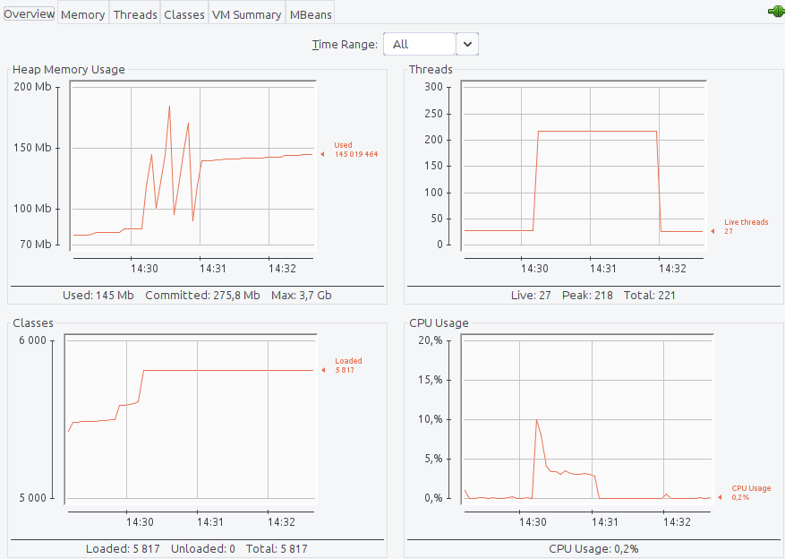

=== Влияние CompletableFeature на ресурсы

.TestController.java
[source,java]
----
    ExecutorService executorService = Executors.newCachedThreadPool();

    String getContext() {
        return StringUtils.repeat("-", 1000);
    }

    void sleep() {
        try {
            TimeUnit.MILLISECONDS.sleep(1000);
        } catch (InterruptedException e) {
            e.printStackTrace();
        }
    }

    @GetMapping("/")
    public String trivial() {
        sleep();
        return getContext();
    }

    @GetMapping("/simple")
    public CompletableFuture<String> simple() {
        return CompletableFuture.supplyAsync(() -> {
            sleep();
            return getContext();
        }, executorService);
    }

    @GetMapping("/nested")
    public CompletableFuture<String> nested() {
        return CompletableFuture.supplyAsync(() -> {
            return CompletableFuture.supplyAsync(() -> {
                        sleep();
                        return getContext();
                    },executorService
            );
        },executorService).get();
    }
----

==== При 500 rps на "/"

|===
|Среднее время ответа (мс) |К-во тредов (шт) |Память (Мб)
>|5000 >|229 >|220
|===

https://clck.ru/QhDKp[Результаты yandex-tank]
