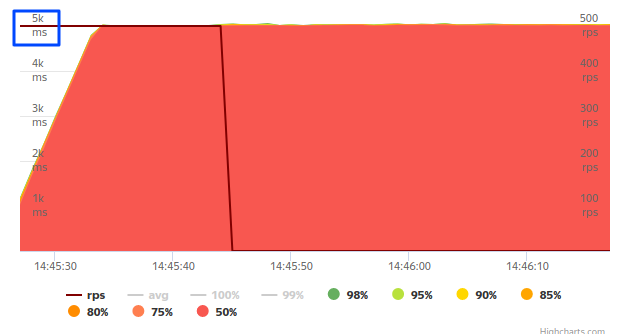
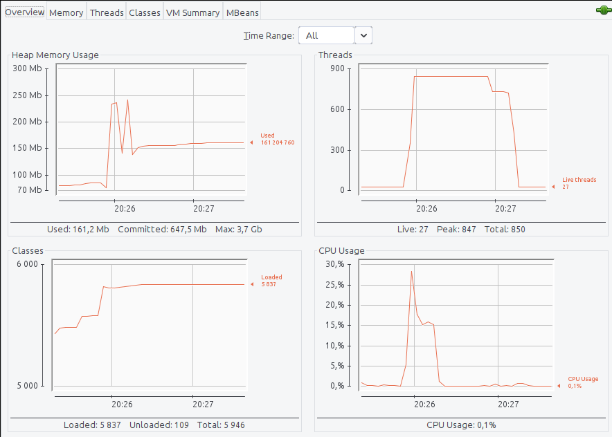
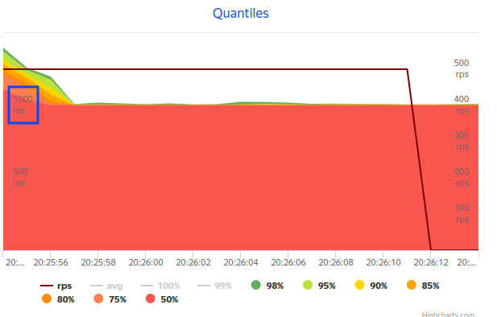
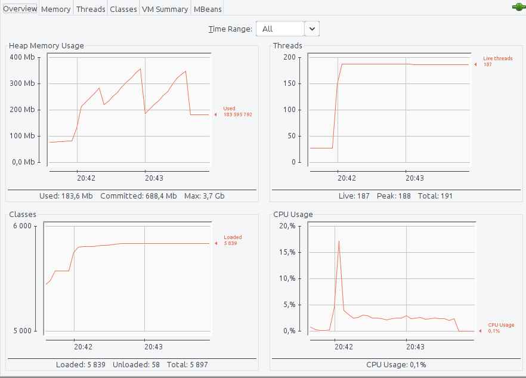
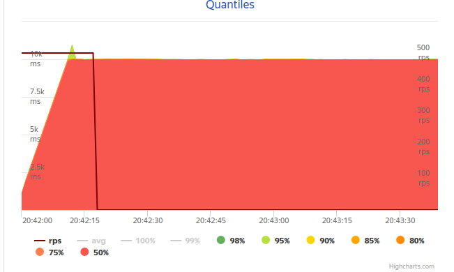

=== Влияние CompletableFeature на ресурсы

.TestController.java
[source,java]
----
    ExecutorService executorService = Executors.newCachedThreadPool();

    String getContext() {
        return StringUtils.repeat("-", 1000);
    }

    // Имитация работы какого-то внешнего сервиса
    void sleep() {
        try {
            TimeUnit.MILLISECONDS.sleep(1000);
        } catch (InterruptedException e) {
            e.printStackTrace();
        }
    }

    @GetMapping("/")
    public String trivial() {
        sleep();
        return getContext();
    }

    @GetMapping("/simple")
    public CompletableFuture<String> simple() {
        return CompletableFuture.supplyAsync(() -> {
            sleep();
            return getContext();
        }, executorService);
    }

    @GetMapping("/nested")
    public CompletableFuture<String> nested() {
        return CompletableFuture.supplyAsync(() -> {
            return CompletableFuture.supplyAsync(() -> {
                        sleep();
                        return getContext();
                    },executorService
            );
        },executorService).get();
    }
----

==== При 500 rps на "/" . Без CompletableFeature

image::doc/trivial-500rps.png[]

|===
|Среднее время ответа (мс) |К-во тредов (шт) |Память (Мб)
>|5 000 >|229 >|150
|===

https://clck.ru/QhDKp[Результаты yandex-tank]

==== При 500rps на "/simple". С CompletableFeature в executorService = Executors.newCachedThreadPool();.

|===
|Среднее время ответа (мс) |К-во тредов (шт) |Память (Мб)
>|1 000 >|847 >|~230
|===

https://clck.ru/QhU5F[Результаты yandex-tank]

==== При 500rps на "/simple". С CompletableFeature в executorService = Executors.newFixedThreadPool(100);.

NOTE: Кол-во свободных тредов меньше нужного

|===
|Среднее время ответа (мс) |К-во тредов (шт) |Память (Мб)
>|>10 000 >|188 >|200-350
|===

https://clck.ru/QhUKM[Результаты yandex-tank]

==== Итоги

Нагрузка во всех вариантах 500rps

|===
|*Схема кэширования*|*Среднее время ответа (мс)* |*К-во тредов (шт)* |*Память (Мб)*
|Без CompletableFeature |5 000 >|229 >|150
|С CompletableFeature Executors.newCachedThreadPool();|1 000 >|847 >|~230
|Кол-во выделяемых сервисом тредов меньше нагрузки (нагрузка 500 rps, а тредов выделено 100) . CompletableFeature executorService = Executors.newFixedThreadPool(100) |>10 000 >|188 >|200-350
|===

С CompletableFeature время ответа сократилось аж в 5 раз! Но, увеличился расход памяти. Неоднозначные результаты в третьей строке (Кол-во выделяемых сервисом тредов меньше нагрузки).

И все таки насколько ценен CompletableFeature? Может быть лучшие результаты даст кеш или оптимизация самих сервисов? По своему опыту скажу, что разработка, тестирование с CompletableFeature, мягко говоря, очень специфична. Возвращая CompletableFeature в методе, вы принуждаете клиента его обрабатывать и перекладывете проблему дальше, и кому-то все-равно придется ее разрулить. Если уж решили использовать CompletableFeature, то сам его тут же и разруливай. Грубо говоря, это локальное(техническое) решение, на уровне приватных методов класса. Остальные классы не должны быть завязаны в эту кашу.

O CompletableFeature https://www.baeldung.com/java-completablefuture